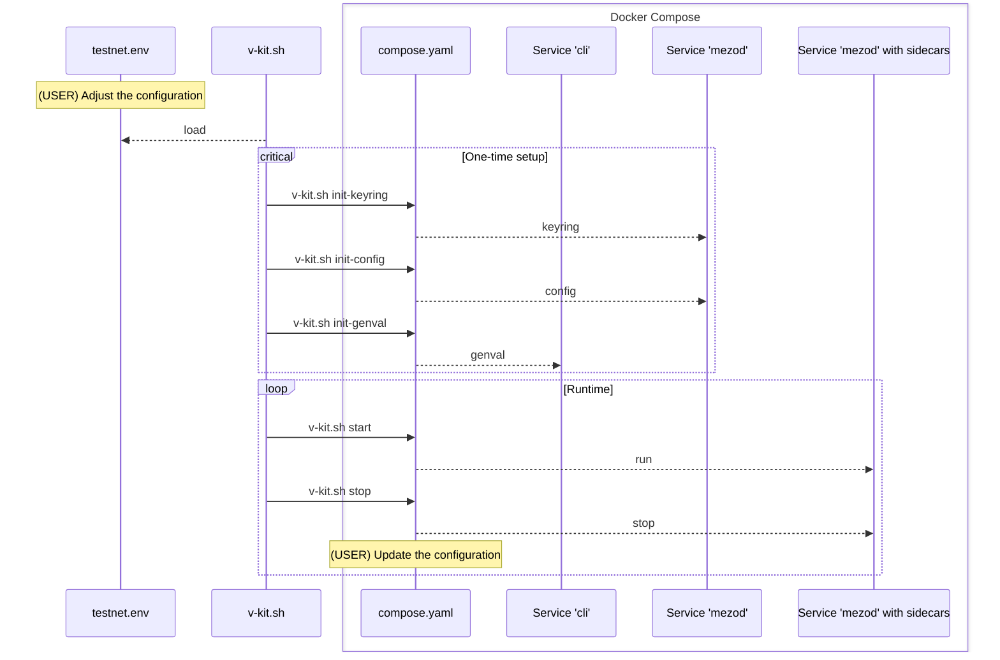

# Docker

## How to configure and run validator?

The following instruction will guide you through the process of configuring
and running a validator node. Before continuing, decide which network you want
to join. There are two options: `testnet` and `mainnet`. The following
instruction will use `testnet` as an example.

> [!NOTE]
> Run `./v-kit.sh` (without arguments) to see the list of available commands.

#### Configuration and runtime flow



### 1. Prepare configuration file

1. Copy the `testnet.env.example` to `testnet.env`:

```shell
cp testnet.env.example testnet.env
```

2. Edit the `testnet.env` file:

* `NETWORK` - the network you want to join (`testnet` or `mainnet`)
* `DOCKER_IMAGE` - the latest version of mezod image
* `LOCAL_BIND_PATH` - the path to the local directory where the data will be stored
  Make sure that the directory is created.

  ```shell
  mkdir -p /path/to/local/data
  ```

* `KEYRING_PASSWORD` - the password for the keyring. It is used to encrypt the key.

  Generate a new password using the following command:

  ```shell
  openssl rand -hex 32
  ```

* `MEZOD_MONIKER` - the name of the validator
* `MEZOD_ETHEREUM_SIDECAR_SERVER_ETHEREUM_NODE_ADDRESS` - the address of the Ethereum node
* `PUBLIC_IP` - the public IP address of the validator

### 2. Initialization

#### Keyring

```shell
./v-kit.sh init-keyring
```

#### Configuration

```shell
./v-kit.sh init-config
```

#### Validator data

```shell
./v-kit.sh init-genval
```

### 3. Submit joining request

TBD

### 5. Run the validator

```shell
./v-kit.sh start
```

## Operations

### Stop the validator

```shell
./v-kit.sh stop
```

### Start (or restart) the validator

```shell
./v-kit.sh start
```

### Edit the configuration manually

Keep in mind that some parts of the configuration are managed by the [entrypoint.sh](./entrypoint.sh) script
within the container. These parts will be overwritten when the container is started.

```shell
./v-kit.sh shell
# use vim or nano
vim path/to/config
```

### Check node status

```shell
./v-kit.sh shell
mezod --home="${MEZOD_HOME}" --node "tcp://mezod:26657" status | jq .
```
