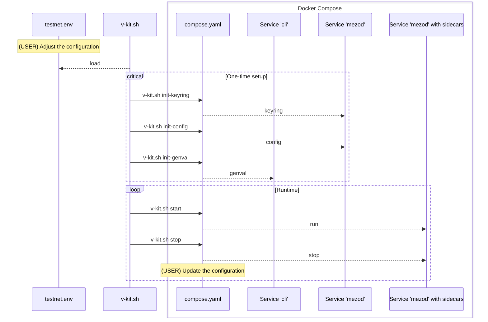

# Docker

## How to configure and run validator?

The following instruction will guide you through the process of configuring
and running a validator node. Before continuing, decide which network you want
to join. There are two options: `testnet` and `mainnet`. The following
instruction will use `testnet` as an example.

> [!NOTE]
> Run `./v-kit.sh` (without arguments) to see the list of available commands.

#### Configuration and runtime flow



### 1. Prepare configuration file

1. Copy the `testnet.env.example` to `testnet.env`:

```shell
cp testnet.env.example testnet.env
```

2. Edit the `testnet.env` file:

* `NETWORK` - the network you want to join (`testnet` or `mainnet`)
* `DOCKER_IMAGE` - the latest version of mezod image
* `LOCAL_BIND_PATH` - the path to the local directory where the data will be stored
  Make sure that the directory is created
  and owned by the user with UID 65532 and GID 65532 ([user inside container](./compose.yaml#21)).

  ```shell
  mkdir -p /path/to/local/data
  sudo chown -R 65532:65532 /path/to/local/data
  ```

* `KEYRING_PASSWORD` - the password for the keyring. It is used to encrypt the key.

  Generate a new password using the following command:

  ```shell
  openssl rand -hex 32
  ```

* `KEYRING_MNEMONIC` - the mnemonic phrase.

  Generate a new mnemonic phrase using the following command:

  ```shell
  ./v-kit.sh generate-mnemonic
  ```

* `MEZOD_MONIKER` - the name of the validator
* `MEZOD_ETHEREUM_SIDECAR_SERVER_ETHEREUM_NODE_ADDRESS` - the address of the Ethereum node.
The URL must be WebSocket, i.e. start with `wss://` (recommended) or `ws://`.
* `PUBLIC_IP` - the public IP address of the validator
* `MEZOD_PORT_P2P` - the port for the P2P connection. Default is `26656`

### 2. Initialization

#### Keyring

```shell
./v-kit.sh init-keyring
```

#### Configuration

```shell
./v-kit.sh init-config
```

#### Validator data

```shell
./v-kit.sh init-genval
```

### 3. Submit joining request

TBD

### 5. Run the validator

```shell
./v-kit.sh start
```

## Operations

### Stop the validator

```shell
./v-kit.sh stop
```

### Start (or restart) the validator

```shell
./v-kit.sh start
```

### Edit the configuration manually

Keep in mind that some parts of the configuration are managed by the [entrypoint.sh](./entrypoint.sh) script
within the container. These parts will be overwritten when the container is started.

```shell
./v-kit.sh shell
# use vim or nano
vim path/to/config
```

### Check node status

```shell
./v-kit.sh shell
mezod --home="${MEZOD_HOME}" --node "tcp://mezod:26657" status | jq .
```

### Check validator info

```shell
./v-kit.sh validator-info
```

## Runbooks

### How to add custom configuration?

The Docker image contains predefined configuration. If you want to add custom configuration,
you can mount a volume with the custom configuration file, and provide the path to the file.
The file will be used to overwrite the default configuration.

There are 3 configuration files that can be overwritten with custom configuration:
- `config.toml`
- `app.toml`
- `client.toml`

Provide a proper environment variables depending on the configuration file you want to overwrite:

```
LOCAL_CUSTOM_CONF_APP_TOML="file/path"
MEZOD_CUSTOM_CONF_APP_TOML=/config/app.toml.txt

LOCAL_CUSTOM_CONF_CLIENT_TOML="file/path"
MEZOD_CUSTOM_CONF_CLIENT_TOML=/config/client.toml.txt

LOCAL_CUSTOM_CONF_CONFIG_TOML="file/path"
MEZOD_CUSTOM_CONF_CONFIG_TOML=/config/config.toml.txt
```

`LOCAL_` prefix is used to indicate the path on the host machine,
and `MEZOD_` prefix is used to indicate the path inside the container.
Files uses `.txt` extension to highlight that the file is a text file, not TOML.

Example for `config.toml` that overwrites `seeds` list:
```
p2p.seeds=2d4e0216da0d1ec18655d9588df21319025efab0@mezo-node-0.test.mezo.org:26656,eedead51f768b908e6ae068e5a8cda6236774010@mezo-node-1.test.mezo.org:26656
```

`seeds` list is under the `p2p` section in the `config.toml` file.

Make sure that the proper binding is uncommented in the `compose.yaml` file:
```
...
    volumes:
      - ${LOCAL_CUSTOM_CONF_CONFIG_TOML}:${MEZOD_CUSTOM_CONF_CONFIG_TOML}
...
```

During the container startup, the custom configuration will be used to overwrite
the default configuration.
Example logs:
```
...
External customizations for config.toml...
update p2p.seeds = 2d4e0216da0d1ec18655d9588df21319025efab0@mezo-node-0.test.mezo.org:26656,eedead51f768b908e6ae068e5a8cda6236774010@mezo-node-1.test.mezo.org:26656 in /var/mezod/config/config.toml
plan successfully applied
...
```
